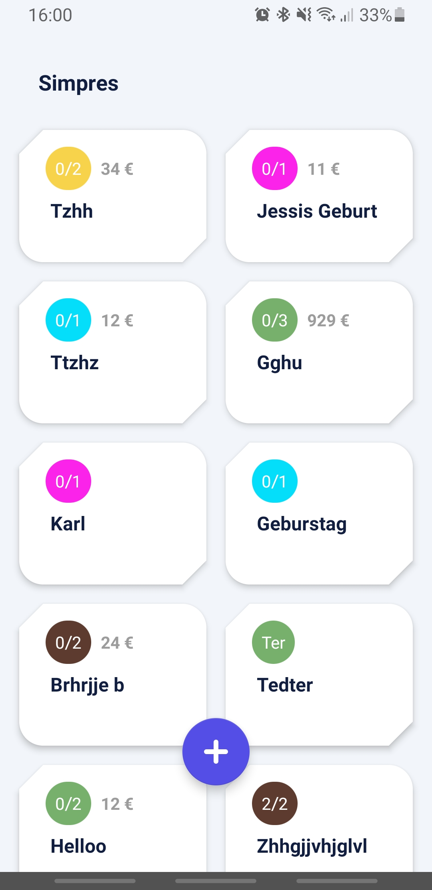

<h1 align="center">
    Simpress
</h1>

Organize presents with ease.

## Screens

***
## Setup
This app is based on android "jetpack" and architecture components and uses Gradle at least 4.10.1. **Kotlin** is used as the main language of this project.

This means that at minimum **Android Studio 3.3** should be used for successful builds with a Kotlin Plugin of 1.3 and up.
***
## Architecture
To accelerate development and testability, a `Model-View-ViewModel (MVVM)` approach with android [architecture components](https://developer.android.com/jetpack/arch/) and [Databinding](https://developer.android.com/topic/libraries/data-binding/) is used. Base classes for viewModels and fragments give a structure to build upon. `LiveData<>` is used in conjunction with Databinding for updating activities and fragments with their corresponding `lifecycle`.

- Uses `objectBox` for storing
